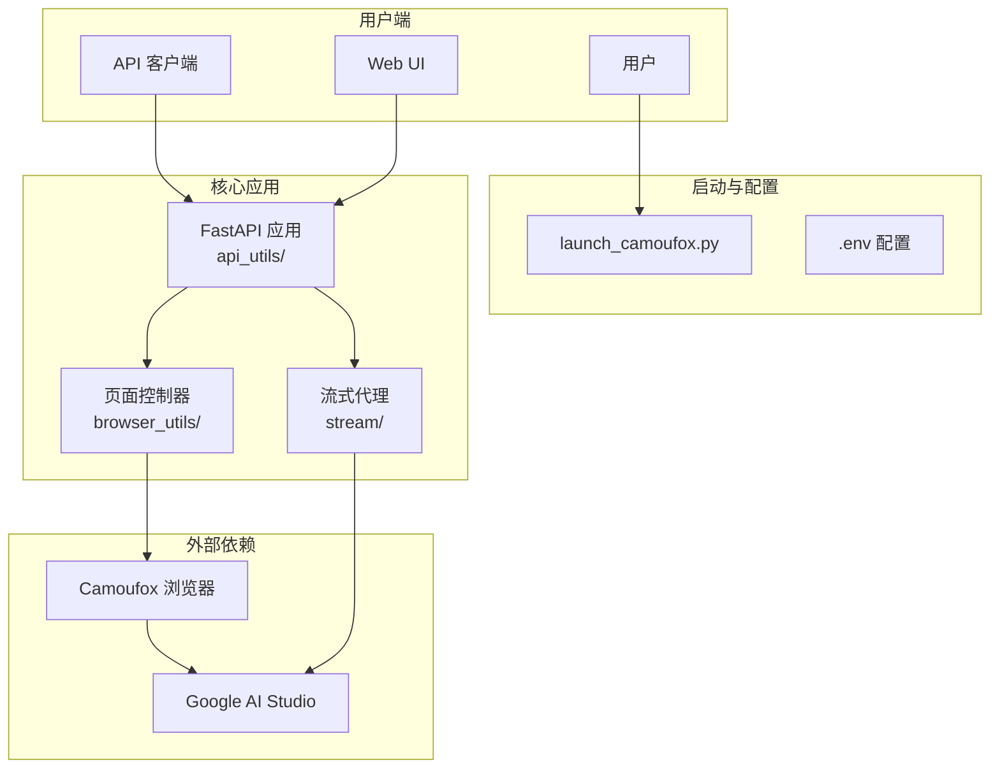

# AI Studio Proxy API

将 Google AI Studio 网页界面转换为 OpenAI 兼容 API 的代理服务器。通过 Camoufox (反指纹检测 Firefox) 和 Playwright 自动化，提供稳定的 API 访问。

[](https://www.star-history.com/#CJackHwang/AIstudioProxyAPI&Date)

> 本项目由 [ZMTO](https://zmto.com/) 慷慨赞助服务器支持。

---

## 主要特性

- **OpenAI 兼容 API**: 完全兼容 `/v1/chat/completions` 端点和主流客户端
- **三层流式响应机制**: 集成流式代理 → 外部 Helper → Playwright 页面交互
- **智能模型切换**: 动态切换 AI Studio 模型，完整参数控制
- **反指纹检测**: Camoufox 浏览器降低被检测风险
- **现代化 Web UI**: 内置测试界面、状态监控、API 密钥管理
- **脚本注入 v3.0**: Playwright 原生网络拦截，支持油猴脚本动态挂载

## 系统要求

| 组件         | 要求       | 推荐           |
| ------------ | ---------- | -------------- |
| **Python**   | ≥3.9, <4.0 | 3.10+ 或 3.11+ |
| **依赖管理** | Poetry     | 最新版本       |
| **内存**     | ≥2GB       | ≥4GB           |
| **网络**     | 稳定互联网 | 可配置代理     |

---

## 🚀 快速开始

> 详细指南请参考 **[快速开始指南](docs/quick-start-guide.md)**

### 三步部署

```bash
# 1️⃣ 克隆并安装
git clone https://github.com/CJackHwang/AIstudioProxyAPI.git
cd AIstudioProxyAPI
poetry install

# 2️⃣ 配置环境
cp .env.example .env
nano .env  # 设置 AUTO_SAVE_AUTH=true 以保存认证

# 3️⃣ 首次认证并启动
poetry run python launch_camoufox.py --debug  # 首次认证（需登录 Google）
# 认证成功后，将 auth_profiles/saved/*.json 移至 auth_profiles/active/
# 然后：
poetry run python launch_camoufox.py --headless
```

### 快速测试

```bash
# 健康检查
curl http://127.0.0.1:2048/health

# 获取模型列表
curl http://127.0.0.1:2048/v1/models

# 测试聊天
curl -X POST http://127.0.0.1:2048/v1/chat/completions \
  -H "Content-Type: application/json" \
  -d '{"model":"gemini-2.5-pro-preview","messages":[{"role":"user","content":"Hello"}]}'
```

访问 `http://127.0.0.1:2048/` 使用内置 Web UI。

---

## 系统架构



---

## 运行模式

| 命令                                          | 说明     | 场景               |
| --------------------------------------------- | -------- | ------------------ |
| `python launch_camoufox.py --headless`        | 无头模式 | 日常使用、服务器   |
| `python launch_camoufox.py --debug`           | 调试模式 | 首次认证、故障排查 |
| `python launch_camoufox.py --virtual-display` | 虚拟显示 | Linux 无 GUI 环境  |

---

## ⚙️ 配置

项目使用 `.env` 文件统一配置管理：

```bash
cp .env.example .env
nano .env
```

### 核心配置

| 配置                   | 默认值 | 说明                  |
| ---------------------- | ------ | --------------------- |
| `PORT`                 | 2048   | FastAPI 服务端口      |
| `STREAM_PORT`          | 3120   | 流式代理端口 (0 禁用) |
| `UNIFIED_PROXY_CONFIG` | -      | HTTP/HTTPS 代理       |
| `SERVER_LOG_LEVEL`     | INFO   | 日志级别              |

> **详细配置**: [环境变量完整参考](docs/env-variables-reference.md)

---

## 🐳 Docker 部署

```bash
cd docker
cp .env.docker .env
nano .env

docker compose up -d
docker compose logs -f

# 版本更新
bash update.sh
```

> **详细指南**: [Docker 部署指南](docker/README-Docker.md)

---

## 📚 文档

### 快速上手

- **[快速开始指南](docs/quick-start-guide.md)** - 15 分钟快速部署 🎯
- [安装指南](docs/installation-guide.md) - 详细安装步骤
- [认证设置指南](docs/authentication-setup.md) - 首次认证设置
- [日常运行指南](docs/daily-usage.md) - 日常使用

### 功能使用

- [API 使用指南](docs/api-usage.md) - API 端点和配置
- **[OpenAI 兼容性说明](docs/openai-compatibility.md)** - 与 OpenAI API 差异 🔄
- [客户端集成示例](docs/client-examples.md) - 代码示例 💻
- [Web UI 使用指南](docs/webui-guide.md) - Web 界面功能
- [脚本注入指南](docs/script_injection_guide.md) - 油猴脚本功能 (v3.0)

### 高级配置

- [环境变量配置指南](docs/environment-configuration.md) - 配置管理 ⭐
- [环境变量完整参考](docs/env-variables-reference.md) - 所有配置项 📋
- [流式处理模式详解](docs/streaming-modes.md) - 三层响应机制
- [高级配置指南](docs/advanced-configuration.md) - 高级功能
- [故障排除指南](docs/troubleshooting.md) - 问题解决

### 开发相关

- [项目架构指南](docs/architecture-guide.md) - 模块化架构
- [开发者指南](docs/development-guide.md) - Poetry、Pyright 工作流

---

## 客户端配置示例

以 **Open WebUI** 为例：

1. 进入 "设置" → "连接"
2. 添加模型，**API 基础 URL**: `http://127.0.0.1:2048/v1`
3. **API 密钥**: 留空或任意字符
4. 保存并开始聊天

---

## 致谢

- **项目发起与主要开发**: [@CJackHwang](https://github.com/CJackHwang)
- **核心维护** (架构重构、测试体系): [@NikkeTryHard](https://github.com/NikkeTryHard)
- **功能完善、页面操作优化**: [@ayuayue](https://github.com/ayuayue)
- **实时流式功能优化**: [@luispater](https://github.com/luispater)
- **项目重构贡献**: [@yattin](https://github.com/yattin) (Holt)
- **社区支持**: [Linux.do 社区](https://linux.do/)

---

## 贡献

欢迎提交 Issue 和 Pull Request！

## License

[AGPLv3](LICENSE)

## 支持作者

如果本项目对您有帮助，欢迎支持作者的持续开发：


